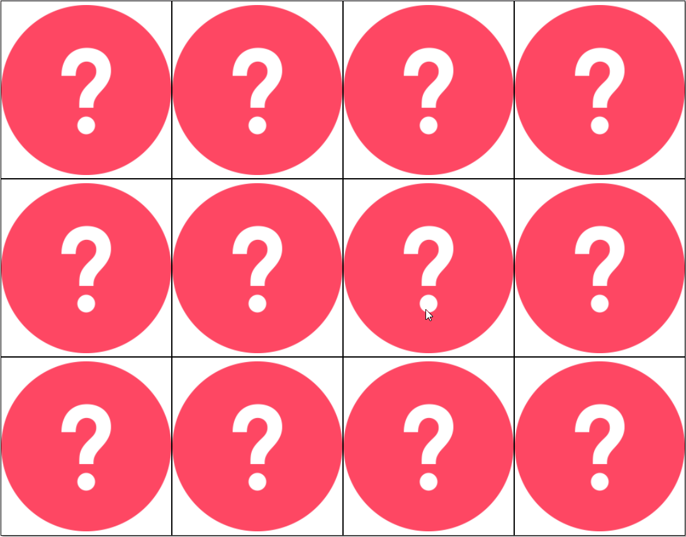

# Memory game with quasi-random images fetched from Flickr API

A simple memory game using Angular 1.5 (from 2017).

Images are pulled from among the most recent 100 images in [the ***squared circle*** flickr group's photo pool](https://www.flickr.com/groups/circle/pool/).

A little sample of gameplay:

